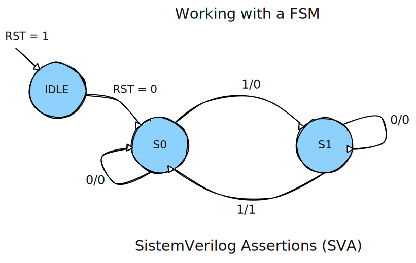

- [Verification Project](#verification-project)
- [Finite State Machine](#finite-state-machine)
  - [Design Purpose](#design-purpose)

# Verification Project
# Finite State Machine

## Design Purpose

A sequential finite state machine (FSM) that responds to a binary input din and generates an output dout, with three defined states: idle, s0, and s1. Behavior depends on din and the current state, with synchronous transition logic and combinational logic to determine the next state and output (see Figure 1).

   
  <em>Figure 1: FSM.</em>

| Signal | Direction	| Description |
|-------|-----------|--------------------------------|
|clk	| input	| Positive clock to synchronize transitions|
|rst	| input	| Active synchronous reset high|
|din	| input	| Binary input that controls transitions|
|dout	| output | Binary output controlled by state and din |

